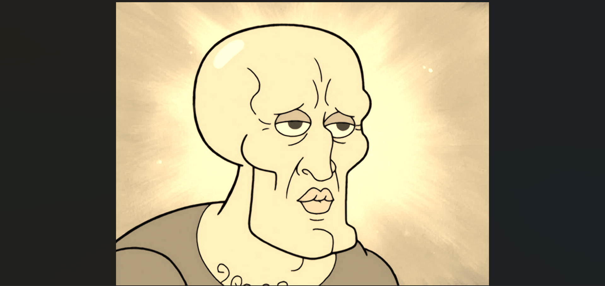

<!DOCTYPE html>
<html lang="en">
<head>
  <meta charset="UTF-8">
  <meta name="viewport" content="width=device-width, initial-scale=1.0">
  <title>Sihun Kim Portfolio</title>
  
</head>

<body>
  

    
    <h1>Sihun Kim</h1>
    
Website: <a href="mailto:shun14656@gmail.com">ksh12589@gmail.com</a>

    
Phone: (675) 342-8970

    
Address: 789 Wildcat Way, Brea, CA 92821

    
Email: <a href="mailto:shun14656@gmail.com">ksh12589@gmail.com</a>

    
  

</body>
</html>
